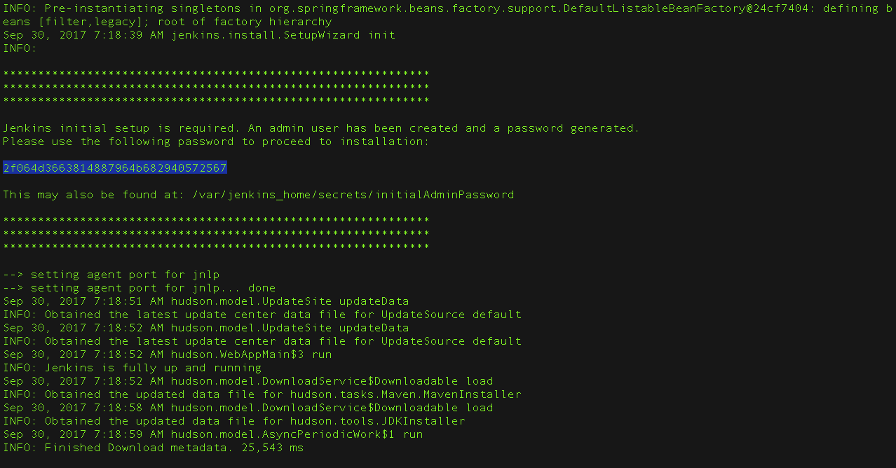

`docker pull jenkins/jenkins:lts`

`docker run --name jenkins-server -d -p 8080:8080 jenkins/jenkins:lts`

`docker container ls`

`containerId=$(docker container ls --filter name=jenkins-server --quiet)`

`docker exec $containerId cat /var/jenkins_home/secrets/initialAdminPassword`

#direct installation

wget https://get.jenkins.io/war-stable/latest/jenkins.war -O ~/jenkins.war

java -jar ~/jenkins.war

passowrd will be displayed in console as shown in image.png

